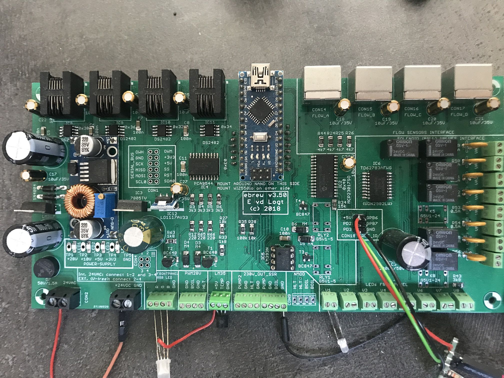
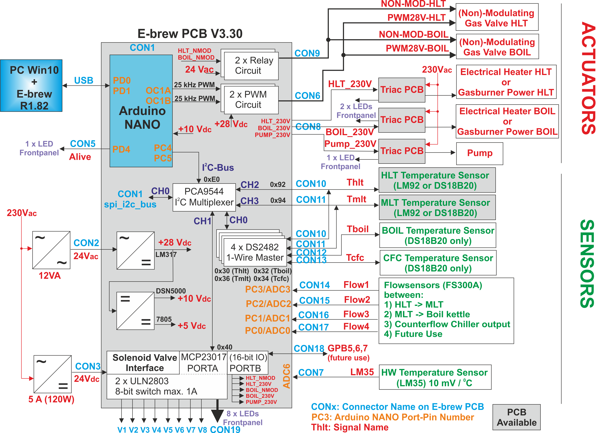

# Home-Brewery Automation with an Arduino Nano
Arduino Nano firmware for my home-brewery

 
*Top view of v3.50 of the main-PCB*

# Features
The current PCB and firmware have the following features:
- Reading a maximum of 4 temperature sensors: one each for the three brewing-kettles and one at the output of the counterflow-chiller. Both one-wire and I2C sensors are supported
- Reading of the hardware temperature: this is to protect the power-electronics
- Reading a maximum of 4 flowsensors: between HLT and MLT, between MLT and boil-kettle, one at the output of the counterflow-chiller and a spare one.
- Control of 8 solenoid ball-valves at 24 V DC
- Control of 4 actuators at 230 V AC: the pump, a second pump (for the HLT counterflow-chiller), the HLT gasburner and the boil-kettle gasburner.
- Two PWM signals (25 kHz, 28 VDC) for the gasburners (HLT and boil-kettle burners)
- Network and USB connection to PC

 
*Hardware architecture of PCB v3.50*

More hardware and firmware design details: see my website: http://www.vandelogt.nl/uk_hardware.php

# Software Development Environment
Use with Atmel Studio v6 or higher.

# Interface with PC
The Arduino-Nano uses a network cable as its main-connection to the PC. This is powered through a WIZ550IO module. It uses DHCP to obtain an IP address automatically.
The standard port number for the firmware is set to 8888. 

The Arduino-Nano also uses a virtual COM port as a backup connection to the PC. This virtual COM port uses the USB port of the Arduino-Nano. At the PC side, the Arduino Nano is recognised by Windows
(if the standard drivers for the Arduino-Nano have been installed). Virtual COM port settings are (38400,N,8,1).

Typically the PC-program sends commands to the Arduino-Nano, like **P0** (Pump Off) or **P1** (Pump On). These commands are then executed by the Arduino-Nano.
Although you can type in the commands manually, it is more efficient to use a dedicated PC-program for it, with a nice Graphical User Interface.

If you install the Arduino Nano PCB for the first time, it is best to use a terminal program that can handle a virtual COM port (I have good results with Realterm). At initial power-up, you can type **S0** to retrieve
the version number of the firmware (and to check that everything is working). The **E1** command enabled the Ethernet module, if everything goes well, the IP address of the Arduino Nano PCB is returned.

More information about the PC-Interface can be found at my website: http://www.vandelogt.nl/uk_hardware.php#PC_INTF

