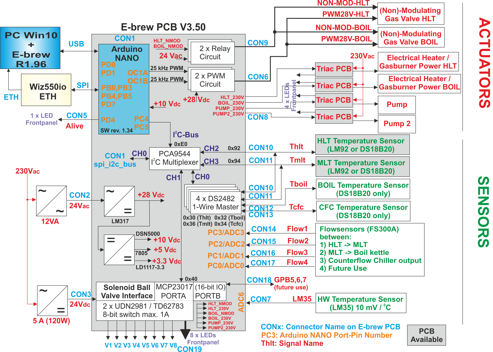

# Home-Brewery Automation with an Arduino Nano
Arduino Nano firmware for my home-brewery

 
*Top view of v3.50 of the main-PCB*

# Features
The current PCB and firmware have the following features:
- Reading a maximum of **6 x temperature sensors**: one each for the three brewing-kettles, one at the output of the counterflow-chiller, one at the entry of the MLT return-manifold and a spare one that 
  can be used as a backup for the HLT or MLT sensor. Both one-wire (4) and I2C sensors (2) are supported.
- Reading of the hardware temperature: this is to protect the Solid State Relays (SSR).
- Reading a maximum of **4 x flowsensors**: between HLT and MLT, between MLT and boil-kettle, one at the output of the counterflow-chiller and one at the entry of the MLT return-manifold.
- Control of **8 x solenoid ball-valves** at 24 V DC.
- Control of **4 x SSR at 230 V AC**: the pump, a second pump (for the HLT counterflow-chiller), 230 V on/off for the HLT and the boil-kettle gasburners.
- **2 x PWM signals (25 kHz, 28 VDC)** for the modulating gasburners (HLT and boil-kettle burners).
- **2 x SSR outputs** for two HLT heating-elements. With this, heating of the HLT is possible with a gas-burner, with 1 or 2 heating-elements of with a combination of these.
- Ethernet and USB connection to PC: USB-connection is used for debugging, main connection between PC-program and the firmware is Ethernet.

 
*Hardware architecture of PCB v3.50*

More hardware and firmware design details: see my website: http://www.vandelogt.nl/uk_hardware.php

# Software Development Environment
Use with Atmel Studio v6 or higher.

# Interface with PC
The Arduino-Nano uses a network cable as its main-connection to the PC. This is powered through a WIZ550IO module. It uses DHCP to obtain an IP address automatically.
The standard port number for the firmware is set to 8888. 

The Arduino-Nano also uses a virtual COM port as a backup connection to the PC. This virtual COM port uses the USB port of the Arduino-Nano. At the PC side, the Arduino Nano is recognised by Windows
(if the standard drivers for the Arduino-Nano have been installed). Virtual COM port settings are (38400,N,8,1).

Typically the PC-program sends commands to the Arduino-Nano, like **P0** (Pump Off) or **P1** (Pump On). These commands are then executed by the Arduino-Nano.
Although you can type in the commands manually, it is more efficient to use a dedicated PC-program for it, with a nice Graphical User Interface.

If you install the Arduino Nano PCB for the first time, it is best to use a terminal program that can handle a virtual COM port (I had good results with Realterm). At initial power-up, you can type **S0** to retrieve
the version number of the firmware (and to check that everything is working). The **E1** command enabled the Ethernet module, if everything goes well, the IP address of the Arduino Nano PCB is returned.

More information about the PC-Interface can be found at my website: http://www.vandelogt.nl/uk_hardware.php#PC_INTF

